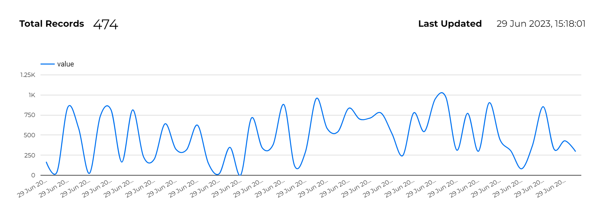

<link rel="preconnect" href="https://fonts.googleapis.com">
<link rel="preconnect" href="https://fonts.gstatic.com" crossorigin>
<link href="https://fonts.googleapis.com/css2?family=Montserrat&display=swap" rel="stylesheet">

<body>
<h2> Publishing data to GCP-Pub/Sub using Python Script </h2>

<h4>The Data Pipeline</h4>

</img>

<h4>Realtime Report using Looker Studio</h4>
</img>
</body>

